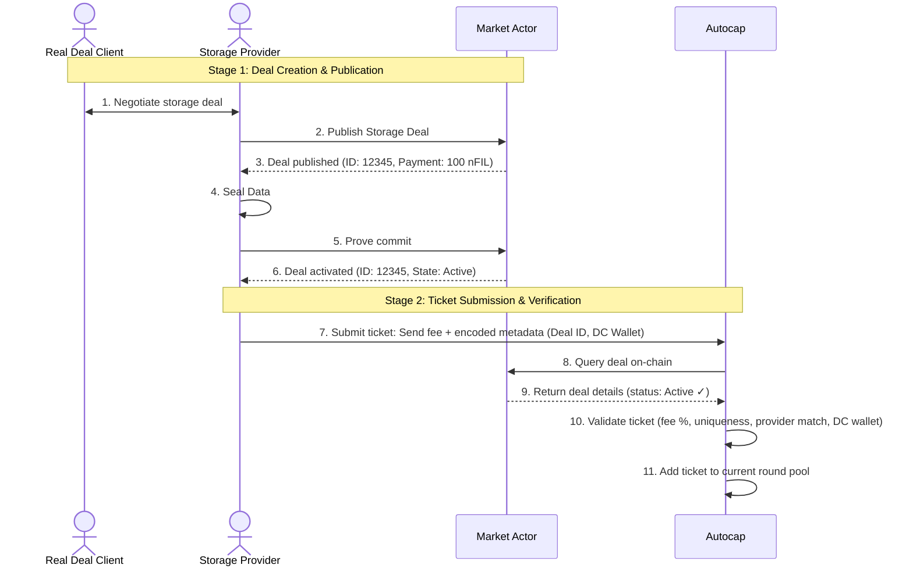
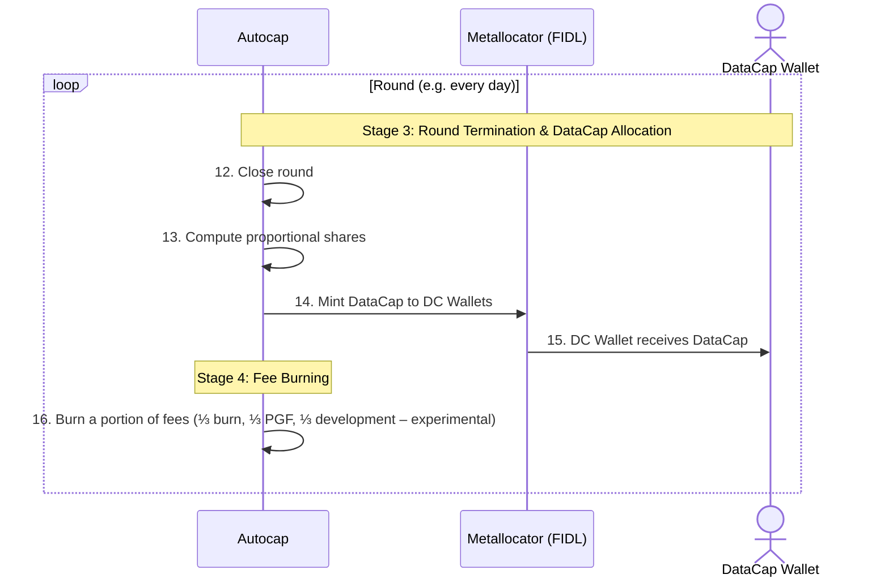

# New Autocap Architecture

## What is Autocap

A mechanism to:

* **Reward Storage Providers (SPs) that brought *paid deals* on-chain**
* **Accrue value in the Filecoin economy** from *on-chain paid deals*

## How it works: high-level overview
`Autocap` issues a fixed amount of **DataCap** at fixed time intervals called *rounds*.
During each round, there are two phases and four stages:
- **Phase 1** - Deal Creation (Stage 1), Ticket Submission and Verification (Stage 2);
- **Phase 2** - DC Allocation (Stage 3) and Fee Burning (Stage 4).
#### Phase 1 - Deal Creation, Ticket Submission and Verification Phase
* An `SP` with an *active on-chain paid deal* submits a `ticket`.
  A **ticket** is simply a FIL transaction to `Autocap` whose `params` encode:
  * the deal ID,
  * the DataCap wallet (`DC Wallet`) where the SP wants to receive DataCap,
  * the `fee` (in FIL) paid to Autocap.
* `Autocap` checks that:
  * the fee is proportional to the *on-chain deal payment* (e.g. fee = 5% of deal payment);
  * the deal was never observed by `Autocap` before (to avoid double spending);
  * the deal is active;
  * the deal provider matches the SP submitting the ticket.
* If these conditions are met, the ticket is valid and the SP is eligible for a DataCap reward at the end of the round.
#### Phase 2 - DC Allocation and Fee Burning Phase
* At the end of each round, Autocap distributes the DataCap rewards proportionally to fees contributed:
  > Higher *on-chain deal payment* → Higher fee → Higher share of the DataCap reward.
* For each ticket, Autocap mints (via the FIDL Metallocator) the DataCap reward into the `DC Wallet` specified in the ticket.
* Autocap burns a portion of collected fees, recirculating value into the Filecoin economy.

---
## Key Actors and working flow

* **Data Client**: the client storing data.
* **Storage Provider (SP)**: makes the deal and engages with Autocap paying and sumbitting the tickets.
* **DataCap Wallet**: wallet where Autocap mints allocated DataCap.
* **Autocap**: the automatic allocator.
* **Metallocator**: [FIDL contract Metallocator](https://github.com/fidlabs/contract-metaallocator), acting as the RKH for this experiment.
---

### Phase 1 - Deal Creation, Ticket Submission and Verification

---

### Phase 2 - DC Allocation and Fee Burning

---

### Stage 1: Deal creation & Publication

Standard Filecoin paid-deal flow through f05 deals:

1. Client and SP negotiate a deal.
2. SP publishes the deal on-chain (`PublishStorageDeal`).
3. SP seals and activates the deal (`ProveCommitSector3`).

---

### Stage 2: Ticket Payment & Verification

#### Ticket payment

An SP submits a ticket to Autocap.
A **ticket** = a FIL transaction with:

* Deal ID
* DataCap Wallet (where DataCap will be minted)
* Fee (in FIL)

The metadata (Deal ID, Wallet) is encoded in the transaction’s `params`.

#### Ticket verification

Autocap checks:

* **Deal existence**: Deal ID exists on-chain.
* **Deal activity**: Deal is active (sealed).
* **Uniqueness**: Deal ID not submitted before.
* **Fee correctness**: Fee = % × Deal Payment.
* **Provider matching**: Sender = deal provider.
* **Wallet validation**: DataCap wallet is valid.

Invalid tickets → fee burned.

⚠️ **Note**: the percentage of the deal payment that is accepted as a fee is yet to be precisely defined.

---

### Stage 3: Round Termination & DataCap Allocation

Rounds occur every **x blocks**.

⚠️ **Note**: x is yet to be defined.

At the round end, Autocap distributes a **fixed DataCap amount `D`** across valid tickets:

$$dc_i = D \cdot \frac{Fee_i}{\sum_j Fee_j}$$

Where:

* $dc_i$ = DataCap to `DC wallet` of i-th valid `ticket`
* $Fee_i$ = fee paid in FIL by that ticket
* $D$ = DataCap amount minted each round
* $\sum_j Fee_j$ = total fees in round

**Plain English:** if 10 tickets each paid 10 FIL, each `DC Wallet` gets 10% of the DataCap minted in that round.

Autocap mints DataCap via the [Metallocator](https://github.com/fidlabs/contract-metaallocator) using `AddVerifiedClient`.

---

### Stage 4: Fee Burning

Collected FIL is split:

* ⅓ burned (value accrual)
* ⅓ PGF (public goods funding)
* ⅓ development funding

⚠️ **Note**: this split is *experimental* and may evolve.

**New round begins.**

