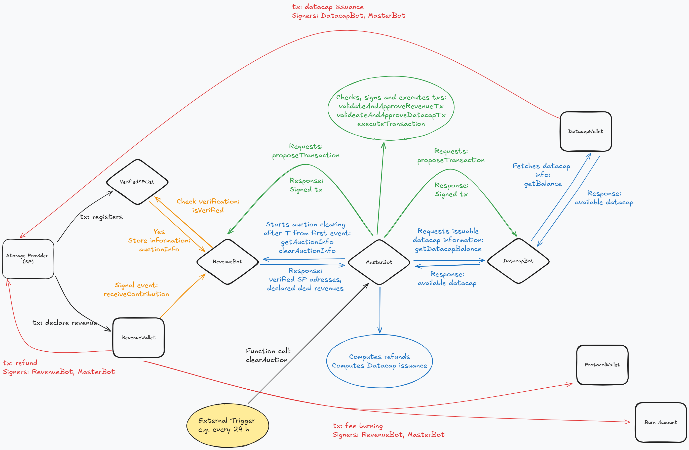

# Fil+ Programmable Allocator Possible Smart Contract Architecture

This document outlines a possible modular smart contract architecture for a Programmable Datacap Allocator on Filecoin. Each component plays a distinct role in facilitating secure and programmable datacap distribution via auctions.

---
## Overview
### Key components
- **`RevenueWallet`**: Multisig wallet that receives FIL from Storage Providers (SPs).
- **`DatacapWallet`**: Multisig wallet holding datacap provided by root key holders.
- **`ProtocolWallet`**: Wallet controlled by the protocol; receives a portion of the fees from each auction.
- **`VerifiedSPList`**: Verifies and registers eligible SPs through zero-FIL transactions.
- **`MasterBot`**: Coordinates auction rounds every 24 hours (triggered externally by **Gelato Web3 Functions**). Gathers auction data from RevenueBot, calculates rewards, fees, and initiates execution of transactions via multisig wallets.
- **`RevenueBot`**: Monitors the RevenueWallet for incoming SP contributions. Verifies SPs against VerifiedSPList. Maintains auctionInfo state containing declared revenues by SPs. Crafts and signs refund transactions from the RevenueWallet.
- **`DatacapBot`**: Tracks available datacap in DatacapWallet. Crafts and signs datacap reward transactions.

### Global Workflow
1. A Storage Provider (SP) registers via `VerifiedSPList`.
2. SP sends a revenue declaration tx in FIL to `RevenueWallet`.
3. `RevenueWallet` signals `RevenueBot`, which:
    -  Checks if the sender is a verified SP by querying `VerifiedSPList`;
    -  Stores the SP contribution (address, FIL) in `auctionInfo`.
5. External Automation (e.g., [Gelato Web3 Functions](https://docs.gelato.network/web3-services/web3-functions)) triggers `MasterBot.clearAuction` e.g. every 24 hours.
8. At each trigger, `MasterBot`:
    - Checks if sufficient datacap is available in `DatacapWallet` via `DatacapBot`;
    - Collects the current auction state from `RevenueBot` obtaining SP addresses and declared deal revenues;
    - Computes Datacap to be issued per SP based on relative contribution;
    - Computes the refund in FIL that need to be issued to each SP;
    - Computes the fee amount that has to be burned and the fee amount that has to be sent to `ProtocolWallet`;
    - Instructs `RevenueBot` and `DatacapBot` to craft and sign the transactions providing them SP adresses with associated FIL refund and datacap rewards.
11. `DatacapBot` and `RevenueBot` prepare and sign transactions.
12. `MasterBot` checks, signs and executes them via the multisig wallets.
13. Rewards are distributed; protocol fee goes to `ProtocolWallet`; remaining fee burned.



### Optional Offchain Application (Frontend)
An optional offchain application may be provided to offer visibility into the system:
- Displays current auction pool state (`auctionInfo` from `RevenueBot`);
- Shows countdown to the next auction round (e.g. based on last round timestamp + 24h);
- Allows SPs to assess whether it is strategic to declare their revenue at a given moment.

### Timing and Automation
The system could rely on  [Gelato Web3 Functions](https://docs.gelato.network/web3-services/web3-functions) to: 
- Trigger `MasterBot.clearAuction` on a daily schedule (e.g., every 24h);
- Ensure fully automated and trust-minimized operation.
- This decouples SP participation from the auction clearing logic and ensures a predictable rhythm of datacap distribution.

---
## Components
### 💰 DatacapWallet
**Type:** Smart contract multisig wallet 
**Purpose:** Custodian of datacap tokens to be distributed to SPs after each auction round

#### Key Characteristics:
- Holds datacap tokens.
- Requires two signatures for outgoing transfers:
  - `DatacapBot`;
  - `MasterBot`.
- Exposes balance to `DatacapBot` for availability checks.

#### Core Functions:
```solidity
function getBalance() external view returns (uint256);
  // Returns current datacap token balance held in the wallet.

function proposeTransaction(address to, uint256 amount, bytes calldata data) external returns (uint256);
  // Creates a new transaction proposal to transfer datacap.

function approveTransaction(uint256 txId) external;
  // Signs approval for a previously proposed transaction.

function executeTransaction(uint256 txId) external;
  // Executes a transaction after the required number of approvals.
```

#### Workflow:
1. `DatacapBot` proposes a transfer.
2. `MasterBot` approves and executes it.

---

### 💰 RevenueWallet
**Type:** Smart contract multisig wallet  
**Purpose:** Receives FIL contributions from SPs and issues refunds post-auction

#### Key Characteristics:
- Receives FIL from Storage Providers.
- Requires two signatures for outgoing transfers:
  - `RevenueBot`;
  - `MasterBot`.
- Notifies `RevenueBot` upon receiving new contributions.

#### Core Functions:
```solidity
function receiveContribution(address sp) external payable;
  // Receives FIL contribution and notifies RevenueBot.
  
function proposeTransaction(address to, uint256 amount, bytes calldata data) external returns (uint256);
  // Creates a new transaction proposal to refund FIL after auction completion.

function approveTransaction(uint256 txId) external;
  // Signs approval for the refund transaction.

function executeTransaction(uint256 txId) external;
  // Executes the transaction after required approvals.
```

#### Workflow:
1. SP sends FIL to `RevenueWallet`.
2. `RevenueWallet` notifies `RevenueBot` that a contribution has been made.
3. `RevenueBot` proposes a transfer.
4. `MasterBot` approves and executes it.

---

### 💼 ProtocolWallet
**Type:** Simple smart contract wallet  
**Purpose:** Receives a portion of fees collected in each auction round

#### Key Characteristics:
- Receives a portion of FIL fees.
- Target destination for protocol-level revenue.

#### Core Functions:
```solidity
function receiveFee() external payable;
  // Receives protocol fee.

function withdraw(address to, uint256 amount) external onlyOwner;
  // Allows withdrawal by the protocol's authorized owner.
```

---

### 🤖 MasterBot
**Type:** Smart contract orchestrator
**Purpose:** Clears the auction round on a fixed schedule. Computes datacap issuance and refunds based on declared SP contributions. Coordinates with `RevenueBot` and `DatacapBot` to prepare, approve, and execute reward and refund transactions.

#### Key Responsibilities:
- Manages timed auction rounds (e.g., every 24 hours).
- Coordinates with `RevenueBot` to fetch current `auctionInfo`.
- Coordinates with `DatacapBot` to verify available datacap.
- Computes:
  - Datacap issuance per SP (proportional to declared revenue).
  - Refunds in FIL per SP.
  - Protocol fees and burn amounts.
- Instructs `RevenueBot` and `DatacapBot` to prepare and sign transactions.
- Validates and co-signs multisig transactions.
- Executes the transactions via the wallets.

#### Core Functions:
```solidity
function clearAuction() external;
  // Called periodically by an external automation service (e.g., Gelato).
  // Performs the full auction clear logic.

function validateAndApproveRevenueTx(bytes32 txHash) external;
  // Approves and signs the RevenueBot-prepared refund transaction.

function validateAndApproveDatacapTx(bytes32 txHash) external;
  // Approves and signs the DatacapBot-prepared datacap grant transaction.

function executeTransaction(uint256 txId) external;
  // Executes a previously approved transaction (refund or grant).
```

#### State Variables:
```solidity
uint64 public auctionDuration;       // Duration of each auction round in epochs or seconds.
uint64 public lastAuctionEpoch;      // Epoch of last cleared auction round.

address public revenueBot;
address public datacapBot;
address public revenueWallet;
address public datacapWallet;
address public protocolWallet;
address public burnAddress;

uint256 public minRequiredDatacap;   // Threshold below which no auction clearing occurs.
```

#### External Automation (e.g., Gelato Web3 Functions):
- Triggers `clearAuction()` every 24 hours.

---

### 🤖 RevenueBot
**Type:** Smart contract actor  
**Purpose:** Manages SP contributions, proposes FIL refunds, co-signs transactions on `RevenueWallet`.

#### Key Responsibilities:
- Receives SP contribution information from `RevenueWallet`.
- Verify through `VerifiedSPList` that SP is verified.
- Maintains SP contribution records in `auctionInfo`.
- Co-signs `RevenueWallet` transactions.

#### Core Functions:
```solidity
function receiveContribution(address sp) external payable;
  // Called by RevenueWallet to store SP's FIL contribution.

function proposeRefundTransactions(address[] sps, uint256[] amounts) external;
  // Proposes refund transactions to RevenueWallet.

function getAuctionInfo() external view returns (address[] memory sps, uint256[] memory contributions);
// Called by MasterBot to retrieve all SPs and their respective contributions.

function clearAuctionInfo() external;
// Called by MasterBot after clearAuction() to reset internal contribution records.

```

#### State Variables:
```solidity
mapping(address => uint256) public auctionInfo;
address public revenueWallet;
address public masterBot;
```

---

### 🤖 DatacapBot
**Type:** Smart contract actor  
**Purpose:** Crafts datacap issuance transactions based on instructions from `MasterBot`. Co-signs transactions on `DatacapWallet`

#### Key Functions:
- Provides datacap balance to `MasterBot`.
- Crafts datacap issuance transactions.
- Co-signs transactions from `DatacapWallet`.

#### Core Functions:
```solidity
function getDatacapBalance() external view returns (uint256);
  // Queries current datacap balance from DatacapWallet.

function proposeGrantTransactions(address[] sps, uint256[] amounts) external;
  // Prepares datacap issuance proposals to SPs.

```

---

### 📜 VerifiedSPList
**Type:** Smart contract actor  
**Purpose:** Maintains registry of Storage Providers (SPs) eligible to participate in auctions

#### Key Responsibilities:
- Registers and verifies SPs via on-chain interactions.
- Stores verification metadata.
- Ensures only verified SPs receive refund by `RevenueWallet` at the end of the auction.

#### Core Functions:
```solidity
function registerSP(address sp) external;
  // Verifies SPs via a zero-value transaction.

function isVerified(address sp) external view returns (bool);
  // Checks verification status of an SP.

function getVerifiedSPs() external view returns (address[] memory);
  // Returns list of all verified SPs.
```

#### State Variables:
```solidity
mapping(address => bool) public verifiedSPs;
address public masterBot;
```
---
